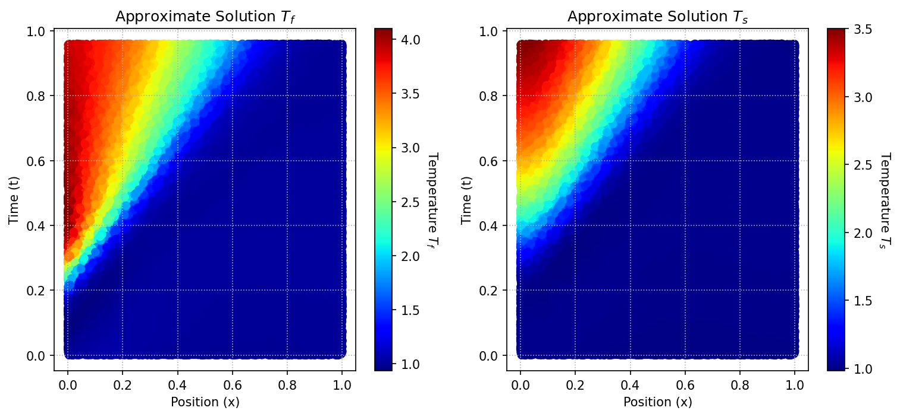

# Solving the Reaction-Convection-Diffusion Equation for the Charging Phase of Thermal Energy Storage Using Physics-Informed Neural Networks

This repository contains the implementation of a Physics-Informed Neural Network (PINN) to model the charging phase of a Thermal Energy Storage (TES) system. This project was developed as part of the course *Deep Learning in Scientific Computing* at ETH Zurich.

## Project Overview

The goal of this project is to leverage PINNs to solve the reaction-convection-diffusion equation during the charging phase of a TES system. TES systems are integral to solar power plants, storing thermal energy during charging phases and releasing it for electricity generation during discharging phases.

### TES System States
The TES system cycles through four states:
1. **Charging**: High-temperature fluid heats the solid storage material.
2. **Idle (Charging to Discharging)**: No fluid flow between phases.
3. **Discharging**: Cold fluid absorbs heat from the solid storage material.
4. **Idle (Discharging to Charging)**: No fluid flow between phases.

The project focuses on the **charging phase** of the **first cycle**, aiming to find a solution using the PINN framework.

## Theoretical Background

The charging phase is governed by a set of reaction-convection-diffusion equations:

$$
\frac{\partial \bar{T}_f}{\partial t} + U_f \frac{\partial \bar{T}_f}{\partial x} = \alpha_f \frac{\partial^2 \bar{T}_f}{\partial x^2} - h_f (\bar{T}_f - \bar{T}_s), \quad x \in [0, 1] \, t \in [0, 1]
$$

$$
\frac{\partial \bar{T}_s}{\partial t} = \alpha_s \frac{\partial^2 \bar{T}_s}{\partial x^2} + h_s (\bar{T}_f - \bar{T}_s), \quad x \in [0, 1], \, t \in [0, 1]
$$

### Initial and Boundary Conditions

$$
\bar{T}_f(x, t=0) = \bar{T}_s(x, t=0) = T_0, \quad x \in [0, 1]
$$

$$
\frac{\partial \bar{T}_s}{\partial x}\bigg|_{x=0} = \frac{\partial \bar{T}_s}{\partial x}\bigg|_{x=1} = \frac{\partial \bar{T}_f}{\partial x}\bigg|_{x=1} = 0, \quad t \in [0, 1]
$$

$$
\bar{T}_f(x=0, t) = \frac{T_{\text{hot}} - T_0}{1 + \exp(-200(t - 0.25))} + T_0, \quad t \in [0, 1]
$$

### Parameter Values
- $$\alpha_f = 0.05$$, $$\alpha_s = 0.08 $$
- $$h_f = 5$$, $$h_s = 6 $$
- $$T_0 = 1$$, $$T_{\text{hot}} = 4 $$
- $$U_f = 1 $$

## Implementation

The project uses PINNs to solve these equations. PINNs integrate the physical laws governing the system into the neural network's loss function, ensuring that the learned solution satisfies the underlying differential equations.

### Features
- Neural network design using PyTorch.
- Integration of physical constraints via loss functions.
- Visualization of temperature profiles for fluid and solid phases.

### Training parameters
- Architecture: 4 hidden dense layers, 20 neurons each layer.
- Optimizer: Adam
- Learning rate: 0.001
- Epoch: 5000
- Training time: ~5 minutes with GPU.

## Results

The output of the model demonstrates the temperature distribution in the TES system during the charging phase. 



## How to Run

1. Clone the repository:
   ```bash
   git clone https://github.com/yourusername/thermal-energy-storage-pinn.git
   ```
2. Install dependencies:
   ```bash
   pip install -r requirements.txt
   ```
3. Run the notebook in Google Colab for free GPU:
   ```bash
   pip install -r requirements.txt
   ```
4. View results:

    Output plots will be saved in the ```results``` directory. 
   
